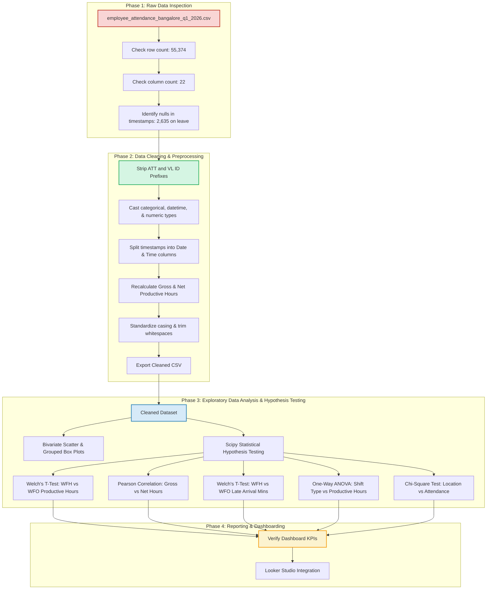

# Employee Attendance & Productivity Analytics (Bangalore Hub - Q1 2026)

This project provides an end-to-end data engineering and analytics solution for tracking, cleaning, analyzing, and visualizing employee attendance and login/logout patterns across five corporate campuses in Bangalore for Q1 2026. The final cleaned dataset is integrated with a Looker Studio dashboard to deliver executive-level HR insights.

---

##  Live Executive Dashboard
The visual insights are presented in the **AURA HR Attendance Dashboard (Bangalore Hub Spec V2)**.

* **Live Report Link**: [Looker Studio Dashboard](https://datastudio.google.com/reporting/5c18b0fa-2c3f-462d-ad71-71d9b96c83df)
* **Live Web Report Link**: [Python Dashboard]([https://datastudio.google.com/reporting/5c18b0fa-2c3f-462d-ad71-71d9b96c83df](https://bzso4ggrukphpnu7my7e3t.streamlit.app/))
* **Dashboard Specifications Mockup**:
  

---

##  Project Pipeline Flowchart

The following flowchart illustrates the step-by-step lifecycle of the data, from raw ingestion to the final dashboard reporting layer:



---

##  Project Directory Structure

```text
Emp_Attendance/
├── Datasets/
│   ├── employee_attendance_bangalore_q1_2026.csv                          # Raw dataset (55,374 rows × 22 cols)
│   └── Employee-attendance-and-login-logout-data-bangalore_cleaned.csv    # Final cleaned dataset (55,374 rows × 28 cols)
├── Data Cleaning/
│   └── employee-attendance-data_cleaning.ipynb                            # Preprocessing & cleaning notebook
├── Data Analysis/
│   ├── employee-attendance-analysis-nabamit.ipynb                         # Full EDA & hypothesis testing notebook
│   └── Bangalore_Attendance_Analytics.ipynb                               # Visualizations & baseline KPI scripts
├── Dashboard/
│   └── Screenshot 2026-08-08 204907.png                                   # Looker Studio dashboard mockup/spec
├── Report/
│   ├── Project_Development_Guide.md                                       # Developer development guide
│   └── Executive_Analytics_Report.md                                      # Executive findings & statistical report
└── README.md                                                              # Main project README (This file)
```

---

##  Data Cleaning & Preprocessing Steps

The data cleaning notebook (`Data Cleaning/employee-attendance-data_cleaning.ipynb`) establishes the structural integrity of the dataset across the following steps:
1. **ID Prefix Removal**: Stripped static string prefixes `ATT` and `VL` from `attendance_id` and `employee_id`, converting them to space-efficient `int64` integers.
2. **Missing Timestamps Check**: Verified that the 2,635 missing values in `login_timestamp` and `logout_timestamp` correspond exactly to days when employees were `"On Leave"`.
3. **Timestamp Splitting**: Converted string timestamps into proper datetimes and split them into separate Date and Time columns (`login_date`, `login_time`, `logout_date`, and `logout_time`).
4. **Recalculating Time Metrics**: Gross hours worked were recalculated as the elapsed duration between logins and logouts. Net productive hours were computed as gross hours minus the break duration (`break_duration_mins / 60.0`). Leave records were filled with `0.0`.
5. **Text Standardization**: Standardized text columns (`gender`, `department`, `designation`, `office_location`, `work_mode`, `leave_type`) by trimming whitespace and converting to Title Case.
6. **Data Export**: Exported the final cleaned dataset as a CSV file to `Datasets/Employee-attendance-and-login-logout-data-bangalore_cleaned.csv`.

---

##  Exploratory Data Analysis & Statistical Tests

We performed five statistical tests using Python's `scipy.stats` library to evaluate workforce policies, shifts, and campus performance:

* **WFH vs. WFO Productivity (Welch's t-test)**:
  * **Null Hypothesis ($H_0$)**: No difference in net productive hours between remote and office workers.
  * **Results**: $t = -4.366$ | $p\text{-value} = 1.27 \times 10^{-5}$ ($p < 0.05$).
  * **Outcome**: **Reject $H_0$**. Remote workers (WFH) achieve statistically significant higher net productive hours than in-office workers (WFO).
* **Gross Hours vs. Net Productivity (Pearson Correlation)**:
  * **Null Hypothesis ($H_0$)**: No linear correlation between total hours worked and net productive hours.
  * **Results**: $r = 0.9886$ | $p\text{-value} = 0.00e+00$.
  * **Outcome**: **Reject $H_0$**. There is an extremely strong, positive linear correlation, confirming gross hours worked is a reliable proxy for active productivity.
* **WFH vs. WFO Punctuality (Welch's t-test)**:
  * **Null Hypothesis ($H_0$)**: Average late arrival minutes are the same for WFH and WFO.
  * **Results**: $t = 28.254$ | $p\text{-value} = 2.81 \times 10^{-172}$.
  * **Outcome**: **Reject $H_0$**. In-office work modes (WFO) accumulate significantly more late arrival minutes, proving that remote work mitigates commute delays.
* **Shift Type vs. Productive Output (One-way ANOVA)**:
  * **Null Hypothesis ($H_0$)**: Productivity is uniform across all shift types.
  * **Results**: $F = 22.45$ | $p\text{-value} = 1.51 \times 10^{-18}$.
  * **Outcome**: **Reject $H_0$**. Shift types significantly affect active output. **Flexible shifts (10:30-19:30)** produce the highest output (**7.81 hrs**) and **Early shifts (08:00-17:00)** the lowest (**7.50 hrs**).
* **Campus vs. Attendance (Chi-Square Independence Test)**:
  * **Null Hypothesis ($H_0$)**: Office location and attendance status (Present, On Leave, Half Day) are independent.
  * **Results**: $\chi^2 = 2.70$ | $\text{dof} = 8$ | $p\text{-value} = 0.952$ ($p > 0.05$).
  * **Outcome**: **Fail to reject $H_0$**. Attendance rates and leaves are independent of the office campus, showing consistent workforce participation across all locations.

---

##  Core Key Performance Indicators (KPIs)

The following metrics are validated and reflected on the executive Looker Studio dashboard:

| KPI | Value | Description |
| :--- | :--- | :--- |
| **Total Employees** | **980** | Count of unique active employees in Q1 2026. |
| **Weighted Attendance Rate** | **94.17%** | Present days plus half of the half-days, divided by total records. |
| **Unweighted Attendance Rate** | **95.24%** | Total active present days (Present + Half Day) divided by total records. |
| **Avg Hours Worked** | **8.72 hrs** | Gross daily logged-in duration per shift (excl. leaves). |
| **Avg Net Productive Hours** | **7.73 hrs** | true working hours spent on tasks (excl. breaks & leaves). |
| **Avg Productivity Ratio** | **88.59%** | Efficiency percentage calculated as `Net Productive Hours / Gross Hours`. |
| **Late Arrival Rate** | **49.63%** | Percentage of shifts where the employee logged in after the shift start. |
| **Early Exit Rate** | **32.39%** | Percentage of shifts where the employee logged out before the shift end. |
| **Avg Overtime Hours** | **0.63 hrs** | Average excess hours worked on active overtime shifts. |
| **WFH Share (Active Shifts)** | **21.31%** | Remote work ratio calculated as `WFH / (WFH + WFO)`. |
| **Total On Leave** | **2,635** | Total absenteeism count representing a **4.76%** leave rate. |

---

##  Project Documentation References

Detailed breakdowns are available in the `Report/` directory:
1. **[Project Development Guide](Report/Project_Development_Guide.md)**: Developer documentation detailing the raw inspection, cleaning scripts, and Scipy implementation.
2. **[Executive Analytics Report](Report/Executive_Analytics_Report.md)**: Business findings, statistical test outputs, and strategic HR recommendations.
